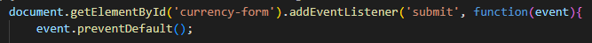
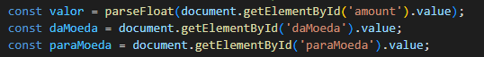
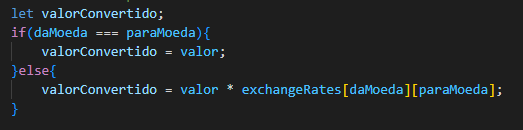
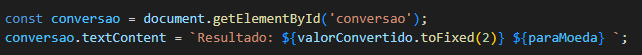

# **Conversor de Moeda 💵🪙**
## **Introdução**
Esse projeto consiste em um conversor de moedas, de ínicio nos temos a conversão para Dólar(USD), Euro(EUR) e Real(BRL), mas que futuramente pode receber uma atualização para outras moedas e criar maior diversidade.
O usuário pode incerir o valor que deseja converter, ele seleciona para que tipo de moeda ele deseja converter e em seguida o programa retorna o valor já convertido.

## **Funcionalidades** ⚙️
**Entrada de Valor:** O usuário terá a opção de inserir o valor que deseja converter.
 
**Seleção de Moedas:** O sistema permitirá que o usuário escolha a moeda de origem e a moeda de destino a partir de uma lista de opções, como Dólar, Euro e Real.
 
**Conversão:** O sistema fará a conversão usando uma taxa de câmbio fixa (definida previamente no código) e mostrará o valor convertido na moeda de destino.
 
**Reset:** O usuário terá a opção de ajustar o valor e as escolhas de moedas para efetuar uma nova conversão.

## **Explicação de código JavaScript**
**1. Capturar o Evento de Envio do Formulário:**

* O código encontra o formulário **HTML** com o **ID** ``currency-form`` e adiciona um "ouvinte de evento" para o evento ``submit`` (quando o formulário é enviado).

* ``event.preventDefault()`` impede o comportamento padrão do formulário (recarregar a página), permitindo que a conversão seja feita dinamicamente.

**2. Obter os Valores de Entrada do Usuário:**
 

* Aqui, o código pega o valor monetário que o usuário inseriu e o converte para um número decimal usando ``parseFloat``.
* ``daMoeda`` e ``paraMoeda`` representam as moedas de origem e destino, respectivamente, que o usuário selecionou.

**3. Definir Taxas de Câmbio Fixas:**
 

* A variável ``exchangeRates`` armazena um objeto com as taxas de câmbio fixas para conversões entre USD, BRL e EUR.

**4. Conversão de Moeda:**
 

* O código verifica se a moeda de origem ``(daMoeda)`` é a mesma que a moeda de destino ``(paraMoeda)``. Se sim, não é necessária conversão, e ``valorConvertido`` recebe o valor original.
* Caso contrário, ele multiplica o valor original pela taxa de câmbio correspondente, obtendo o valor convertido.

**5. Exibir o Resultado da Conversão:**
 

* O elemento **HTML** com o **ID** ``conversao`` exibe o resultado da conversão.
* ``valorConvertido.toFixed(2)`` limita o valor convertido a duas casas decimais, e ``paraMoeda`` exibe a unidade da moeda convertida.

## **Tecnologias**
 

 
   
   
   
 

 
 
##
 
## **Quer me conhecer?**
  

   
   
    

